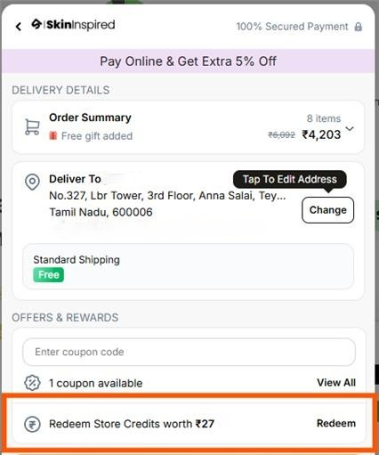
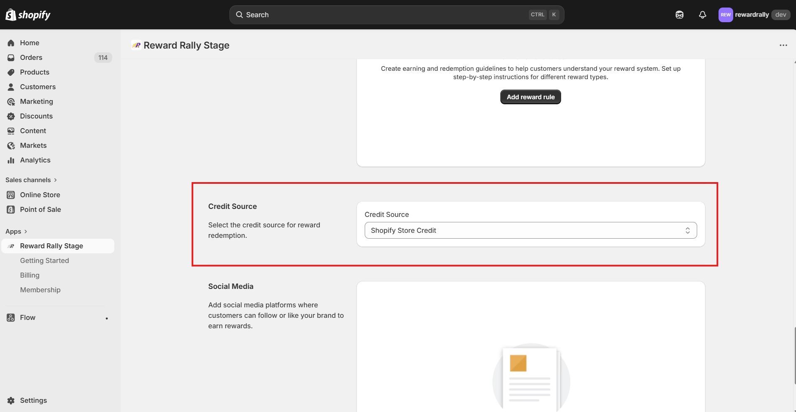

The **Shopify Store Credit Sync** feature allows your customers to use their RewardRally points as actual store credit directly at your Shopify checkout. This creates a seamless experience where rewards feel like "real money."

## What it is

Normally, reward points and Shopify store credit live in two different places. This feature bridges that gap so your customers have one unified balance.

### Why use it?

- **Frictionless Checkout:** Customers can spend their earned rewards at checkout just like a gift card or credit, without needing to copy-paste discount codes.
- **Real-Time Updates:** When a customer spends credit on Shopify, their RewardRally balance updates instantly. When they earn points in RewardRally, their Shopify credit increases.
- **Automatic Handling:** No manual work is required from your team. The system handles conversions and balance updates automatically.

### Customer Experience

1.  **Earning:** A customer earns points through actions like placing an order, receiving a welcome bonus, playing "spin the wheel," or referring a friend.
2.  **Conversion:** RewardRally automatically converts those points into your store's currency (e.g., INR).
3.  **Spending:** At checkout, the customer sees "Store Credit" as a payment option. Using it automatically adjusts their RewardRally point balance.

---

## How to enable it

Follow these simple steps in your RewardRally Admin Dashboard to get started.

### Step 1: Configure Your Conversion Rates

RewardRally uses two specific rates to manage your program's economy, which are configured in different dashboards:

1.  **Point Conversion (Earning):** This determines how many points a customer earns based on their spend (e.g., **₹100 = 5 points**).  
    *PS: This is set in your **Shopify RewardRally Admin Dashboard.***

2.  **Coin Conversion Rate (Redeeming):** This determines the monetary value of those points when they are turned into store credit. Following the example above, **5 points = 5 coins**, which gives the customer **₹5.00** in store credit.  
    *PS: This is set in your **RewardRally Admin Dashboard.***

To set these:
1.  Access each dashboard as described above.
2.  Enter your desired values in the respective fields.
3.  Click **Save**.

### Step 2: Select Store Credit Source

1.  Navigate to your **Shopify Admin Dashboard**.
2.  Look for the **Credit Source** dropdown menu.
3.  Select **SHOPIFY_STORE_CREDIT**.
4.  Click **Save Changes**.

### Step 3: Verify Permissions

RewardRally needs permission to talk to your Shopify store's credit system. 

- Most stores have these permissions enabled by default during the initial app installation.
- If the sync isn't working, visit your **Shopify Admin** > **Apps** > **RewardRally** and ensure "Store Credit" permissions are granted.

---

## Frequently Asked Questions

**What happens if I refund an order?**  
RewardRally is smart enough to recognize refunds. If you issue a refund directly through Shopify, the system will ensure the customer's reward balance remains accurate without double-counting.

**Can customers use points and a credit card together?**  
Yes! Shopify allows customers to "split" their payment between their store credit balance and another payment method like a credit card or PayPal.
